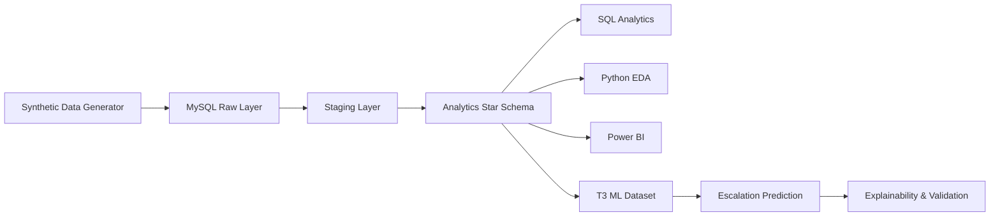

# Insightal AI — Conversational AI & BFSI Voice Analytics Platform

## Project Overview

Insightal AI is a synthetic/anonymized BFSI conversational AI analytics platform designed to analyze voice interactions across:

- Loan Collections
- Payment Reminders
- Loan Applications
- EMI Queries
- Insurance
- Customer Support
- Payment Failures
- Complaints
- Lead Qualification

The core business objective is to turn conversational AI call data into operational, customer, collections, AI-quality, escalation, and business-impact insights.

*This project uses synthetic/anonymized data for portfolio and demonstration purposes. It does not contain real customer PII.*

## Business Problem

The project answers the following key business questions:

- How many calls are handled?
- How effective is the AI?
- Where are customers falling out of the journey?
- How often does the AI contain or resolve interactions?
- When is human escalation required?
- How are collections performing?
- How much operational capacity can automation create?
- Can future escalation risk be predicted early?

## Solution Overview

The end-to-end analytical solution follows this data flow:

Synthetic Data 
→ MySQL 
→ Raw Layer 
→ Staging Layer 
→ Analytics Layer 
→ SQL Analytics 
→ Python EDA 
→ Power BI 
→ ML Escalation Prediction



## Data Architecture

**Schemas:**
- `insightal_raw`
- `insightal_staging`
- `insightal_analytics`

**Star Schema:**

*Facts:*
- `fact_calls`
- `fact_conversation`

*Dimensions:*
- `dim_customer`
- `dim_intent`
- `dim_bot`
- `dim_campaign`
- `dim_date`

*Role-playing Intent Dimensions (used by Power BI):*
- `dim_intent_call`
- `dim_intent_expected`
- `dim_intent_detected`

## Data Engineering & Quality

**Lineage & Row Counts:**
- Generated clean calls: 10,000
- Raw calls: 10,050
- Clean analytics calls: 9,885
- Raw conversations: 39,958
- Clean conversations: 38,978

*Note: Raw anomalies are intentionally injected into the synthetic dataset and handled through staging/data-quality controls to simulate real-world ETL challenges. Do not imply the data is real-world production data.*

**Phase 6 Data Quality Results:**
- Data Quality Score: 93.00
- PASS: 85
- WARN: 12
- FAIL: 0

## SQL Analytics

The data warehouse is analyzed via 13 SQL analytics files, comprising 25 analytics queries and 17 validation checks (25 successful, 0 failed).

**Major Analytical Areas:**
- Executive KPIs
- Call Operations
- Bot Performance
- Intent Analytics
- Customer Journey
- Escalation Analytics
- Collections
- Campaign Performance
- Customer Segments
- Time Series
- Business Impact
- Advanced SQL

## Key Business KPIs

| KPI | Result |
|---|---|
| Total Calls | 9,885 |
| Connected Calls | 6,183 |
| Connection Rate | 62.55% |
| Average Call Duration | 36.56 sec |
| Median Call Duration | 33 sec |
| Average Attempts | 1.98 |
| Task Completion Rate | 56.93% |
| Resolution Rate | 56.17% |
| Containment Rate | 52.05% |
| Escalation Rate | 36.23% |
| Fallback Rate | 18.93% |
| Intent Recognition Accuracy | 83.39% |
| Average Confidence | 65.08% |
| Bot Quality Score | 63.47% |

## Collections Analytics

- Collections Calls: 2,843
- Connected Collections Calls: 1,748
- Contact Rate: 61.48%
- PTP Rate: 47.37%
- Successful PTP Rate: 62.92%
- Collection Conversion Rate: 67.83%
- PTP Amount: ₹4.65M
- Successful Collection Amount: ₹2.24M
- Outstanding Amount: ₹24.38M
- Outstanding Collected Ratio: 9.19%

*Note: Outstanding Amount uses the latest available outstanding snapshot per customer rather than summing repeated call snapshots.*

## Power BI Dashboard

The Power BI implementation consists of exactly 4 pages, using native Power BI visuals and a consistent enterprise BFSI design on a 1280 × 720 canvas:

1. **Executive Overview** – *"What is happening?"*
2. **Conversational AI & Customer Journey** – *"How well is the AI handling customers?"*
3. **Collections Performance** – *"What business outcome is generated?"*
4. **Business Impact & Escalation** – *"Where is human intervention needed and what value is generated?"*

## Business Impact

- Agent Calls Avoided: 3,218
- Agent Hours Freed: 268.17
- FTE Capacity Freed: 1.49
- Estimated Operational Cost Avoided: ₹160,900

*These are synthetic-model estimates based on the project's defined assumptions.*

## Machine Learning — Escalation Prediction

- **Prediction Point:** Immediately after the 3rd customer turn.
- **Target:** `escalation_after_t3` (Target = 1 when escalation occurs strictly after T3. Calls escalating at or before T3 are excluded).
- **Dataset:** 3,426 eligible T3 snapshots (Positive: 1,374, Negative: 2,052). Target rate: 40.11%.

## ML Features

Emphasizing point-in-time leakage prevention, the features are divided into:

**Conversation Context:**
- detected intent
- running confidence
- fallback count
- sentiment
- call duration so far

**Call Metadata:**
- bot version
- language
- campaign type
- attempt number

**Customer History (prior calls only):**
- previous calls
- previous escalations
- previous fallbacks
- customer segment
- age group
- loan type

**Collections Context:**
- DPD
- DPD bucket
- risk segment
- outstanding amount

## ML Evaluation

**Primary Evaluation:** Chronological train / validation / test splits.
- Train: 2,398
- Validation: 514
- Test: 514

**Champion Model:** Logistic Regression remained the overall champion.
- ROC-AUC: 0.959
- PR-AUC: 0.954
- Precision: 0.883
- Recall: 0.867
- F1: 0.875
- Accuracy: 0.899
- Brier: 0.074

*Random Forest:*
- Test ROC-AUC: 0.952
- Test PR-AUC: 0.950
- Test F1: 0.865
- Test Brier: 0.083

*Note: XGBoost and SHAP were not evaluated because they were unavailable in the controlled environment.*

## Explainability & Robustness

Model decisions were analyzed using Logistic Regression coefficients, permutation importance, local TP/TN/FP/FN explanations, error analysis, threshold analysis, risk bands, and calibration.

**Secondary Customer-Disjoint Result:**
- ROC-AUC: 0.956

The small difference between temporal test ROC-AUC (0.959) and customer-disjoint cross-validation ROC-AUC (0.956) provides supporting evidence that performance is not primarily dependent on repeated customer identities.

## Model Limitations

- Only applies to calls reaching the third customer turn.
- Does not predict calls ending before T3.
- Does not predict escalations already occurring at/before T3.
- Trained on synthetic data; requires real-world validation.
- Requires real-time feature generation for deployment.
- Threshold selection requires a business cost matrix.

## Repository Structure

```
Insightal_AI_BFSI_Analytics/
├── docs/
├── sql/
├── python/
├── ml/
├── scripts/
├── reports/
├── artifacts/
├── notebooks/
├── data/
├── Insightal_AI_BFSI_Analytics.pbip
├── Insightal_AI_BFSI_Analytics.Report/
├── Insightal_AI_BFSI_Analytics.SemanticModel/
└── README.md
```

## Reproducibility

1. **MySQL Setup:** Execute scripts in `sql/` to construct the database schema. Local credentials should be configured through an ignored `.env` file if required.
2. **Python Environment:** Requirements specified for standard Python setups.
3. **SQL Analytics:** Run the `.sql` queries located in `sql/analytics/`.
4. **EDA:** Generate EDA visualisations by executing scripts in the `python/` directory.
5. **ML Pipeline:** Run the Python scripts sequentially in the `ml/` folder to reproduce dataset generation, baseline, and validation phases.

## Project Status

- **Phases 1–13:** COMPLETE
- **ML:** COMPLETE & FROZEN
- **Power BI:** COMPLETE
- **Final end-to-end validation:** IN PROGRESS until final audit passes.

## Security

- Credentials are not committed.
- `.env` is ignored.
- Uses synthetic/anonymized data only.
- Contains no real customer PII.

## License / Disclaimer

License: Not currently specified.
