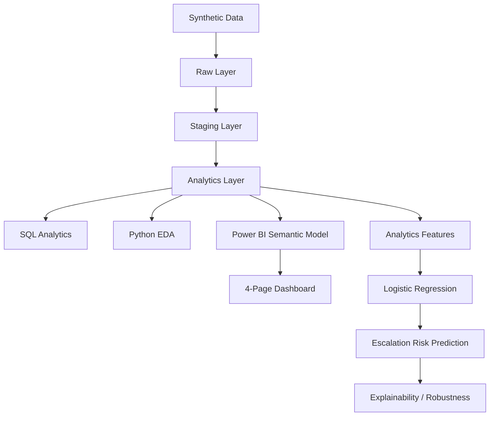

# Insightal AI — Conversational AI & BFSI Voice Analytics Platform

Insightal AI is a comprehensive, end-to-end data analytics and machine learning portfolio project simulating a modern BFSI (Banking, Financial Services, and Insurance) conversational AI environment. It transforms synthetic voice interaction data into actionable operational, collections, and customer journey insights, concluding with a predictive machine learning model to identify high-risk escalations before they occur.

   

## 1. Project Overview

This project analyzes the lifecycle of conversational AI / voice interactions within a BFSI context. It connects raw voice interactions to conversation intelligence, evaluates the customer journey, measures collections outcomes, tracks human escalations, and finally applies predictive analytics to forecast escalation risk. The end goal is to demonstrate the measurable business impact of AI containment and highlight areas requiring human intervention.

*Note: This project is built entirely on synthetic/anonymized data for demonstration purposes and does not contain real customer PII.*

## 2. Business Problem

Financial institutions face significant challenges in measuring and optimizing conversational AI deployments. Key business problems addressed include:
- Limited visibility into AI call performance and true containment rates.
- Difficulty understanding customer journey fallouts and conversation outcomes.
- Opaque intent recognition accuracy and fallback behavior.
- Challenges in attributing collections performance (e.g., PTP) to AI interactions.
- Unpredictable escalations to human agents, leading to capacity strain.
- Quantifying the actual business value (hours/cost saved) of AI containment.

## 3. Business Objectives

- **Operational Visibility:** Establish clear metrics for call handling, containment, and resolution.
- **AI Performance Measurement:** Quantify intent recognition accuracy, confidence, and fallback rates.
- **Customer Journey Analysis:** Track how customers navigate AI interactions and where they drop off.
- **Collections Analytics:** Measure Promise-to-Pay (PTP) conversion and collected amounts driven by AI.
- **Predictive Escalation Analysis:** Predict which ongoing calls are at high risk of escalating to a human agent.
- **Business Impact Measurement:** Model the agent hours and operational costs avoided through successful AI containment.

## 4. Solution Overview

The solution is a complete analytical pipeline structured as follows:

Raw data → Staging → Analytics warehouse → SQL analytics → Python EDA → Power BI semantic model → Interactive dashboard → ML risk prediction → Explainability & business recommendations.

The data architecture relies on a robust three-layer database design:
1. `insightal_raw`
2. `insightal_staging`
3. `insightal_analytics`

## 5. Key Business Questions

The platform answers critical operational questions, including:
- How many calls are being handled and connected?
- How effectively is AI containing conversations?
- How accurate is intent recognition?
- How frequently does the system fall back?
- What is the escalation rate?
- What is the customer journey outcome?
- How effective are collections campaigns?
- What collection outcomes (PTP, amounts) are generated?
- Where is human intervention required?
- How much agent capacity can AI potentially free?
- Which interactions are at higher escalation risk?

## 6. End-to-End Architecture



## 7. Data Model

The core of the platform is a Kimball-style star schema designed for analytical workloads.

**Facts:**
- `fact_calls`: Call-level metrics and outcomes.
- `fact_conversation`: Turn-by-turn conversational intelligence.

**Dimensions:**
- `dim_customer`: Customer demographics and risk segments.
- `dim_intent`: Library of known intents.
- `dim_bot`: AI system versions and configurations.
- `dim_campaign`: Campaign details (e.g., Loan Collections).
- `dim_date`: Standard date dimension.

**Role-Playing Intent Dimensions:**
To accurately model conversations, `dim_intent` plays three roles in the semantic model:
- `dim_intent_call`
- `dim_intent_expected`
- `dim_intent_detected`

## 8. Technology Stack

**Data:**
- MySQL
- SQL

**Analytics:**
- Python
- Pandas
- NumPy
- SciPy

**Visualization:**
- Power BI

**Machine Learning:**
- scikit-learn (Logistic Regression, Random Forest)

**Engineering:**
- Git
- GitHub

## 9. Data Pipeline

The pipeline securely processes and cleans data through the three-tier architecture. 
Reconciliation numbers for the clean analytics population:
- **raw_calls:** 10,050
- **stg_calls:** 10,000
- **fact_calls:** 9,885
- **raw_conversations:** 39,958
- **stg_conversations:** 39,770
- **fact_conversation:** 38,978

Anomalies were intentionally injected into the raw synthetic data and quarantined during staging to simulate realistic ETL challenges.

## 10. Power BI Dashboard

The final implementation features a polished, 4-page Power BI dashboard (1280 × 720 canvas) designed for executive and operational leadership:

1. **Executive Overview:** *"What is happening?"* — High-level KPIs, volume trends, and operational health.
2. **Conversational AI & Customer Journey:** *"How well is AI handling customers?"* — Intent accuracy, fallback analysis, and journey mapping.
3. **Collections Performance:** *"What business outcome is generated?"* — Campaign success, conversion rates, and outstanding recovery.
4. **Business Impact & Escalation:** *"Where is human intervention needed and what value is generated?"* — Modeled capacity savings, cost avoidance, and escalation drivers.

## 11. Key Business KPIs

| Metric | Verified Value |
| :--- | :--- |
| **Total Calls** | 9,885 |
| **Connected Calls** | 6,183 |
| **Connection Rate** | 62.55% |
| **Average Call Duration** | 36.56 sec |
| **Median Call Duration** | 33 sec |
| **Average Attempts** | 1.98 |
| **Task Completion Rate** | 56.93% |
| **Resolution Rate** | 56.17% |
| **Containment Rate** | 52.05% |
| **Escalation Rate** | 36.23% |
| **Fallback Rate** | 18.93% |
| **Average Confidence** | 65.08% |
| **Intent Recognition Accuracy** | 83.39% |
| **Normalized Sentiment** | 55.59% |
| **Satisfaction Proxy** | 54.89% |
| **Reliability** | 87.08% |
| **Bot Quality Score** | 63.47% |

## 12. Collections Analytics

Specific focus was placed on Loan Collections, with careful DAX modeling to ensure the `Outstanding Amount` reflects the *latest customer snapshot* rather than double-counting historical values across multiple calls.

- **Collections Calls:** 2,843
- **Connected Collections Calls:** 1,748
- **Contact Rate:** 61.48%
- **PTP (Promise to Pay) Rate:** 47.37%
- **Successful PTP Rate:** 62.92%
- **Collection Conversion Rate:** 67.83%
- **PTP Amount:** ₹4.65M
- **Successful Collection Amount:** ₹2.24M
- **Outstanding Amount:** ₹24,379,952.04
- **Outstanding Collected Ratio:** 9.19%

## 13. Business Impact

Based on the project's analytical assumptions, AI containment modeled the following business benefits:
- **Agent Calls Avoided:** 3,218
- **Agent Hours Freed:** 268.17 hours
- **FTE Capacity Freed:** 1.49
- **Estimated Cost Avoided:** ₹160,900

*(Note: These are modeled/estimated metrics based on synthetic business assumptions, not actual production savings).*

## 14. Machine Learning

The project culminates in a machine learning pipeline aimed at predicting the risk of escalation to a human agent immediately following the 3rd customer turn (T3). 
- **Champion Model:** Logistic Regression
- **Challenger:** Random Forest
- *Note: XGBoost was not evaluated and SHAP was not used because they were intentionally unavailable in the constrained environment.*

Logistic Regression remained the champion due to superior calibration, interpretability, and robust performance on a highly linearly-separable feature space.

## 15. Model Performance

The Logistic Regression model was evaluated on a chronological test split to prevent temporal leakage:
- **ROC-AUC:** 0.959
- **PR-AUC:** 0.954
- **Precision:** 0.883
- **Recall:** 0.867
- **F1:** 0.875
- **Accuracy:** 0.899
- **Brier Score:** 0.074

*Random Forest (Challenger):*
- Test ROC-AUC: 0.952
- Test PR-AUC: 0.950
- Test F1: 0.865
- Test Brier Score: 0.083

## 16. Explainability & Robustness

Top predictors driving escalation risk included:
- `fallback_count_t3`
- `detected_intent_at_t3`
- `customer_segment`
- `dpd_bucket` / risk segment
- `sentiment`
- `confidence`

**Key Finding:** Fallback behavior was the strongest predictor associated with escalation risk.
*(Interpretation note: Numeric logistic-regression coefficients are interpreted per approximately one standard deviation because numeric features were standardized. Categorical coefficients are relative to their omitted reference category).*

**Robustness:** A customer-disjoint GroupKFold validation strategy was employed as secondary evidence to ensure the model learned generalizable conversational patterns rather than memorizing individual customer identities, yielding a highly stable customer-disjoint ROC-AUC of 0.956.

## 17. Data Quality & Validation

The integrity of the pipeline was strictly enforced:
- **Data Quality Score:** 93.00 (85 PASS, 12 WARN, 0 FAIL).
- Leakage audits (temporal and target) passed.
- Referential integrity passed.
- Temporal/business validation passed.
- Phase 13 end-to-end repository validation and security cleanups passed.

## 18. Repository Structure

```text
insightal-ai--bfsi-analytics/
├── README.md
├── docs/
├── sql/
├── python/
├── ml/
├── scripts/
├── reports/
├── artifacts/
├── notebooks/
├── data/
├── Insightal_AI_BFSI_Analytics.pbip
├── Insightal_AI_BFSI_Analytics.Report/
└── Insightal_AI_BFSI_Analytics.SemanticModel/
```

## 19. Reproducibility / Setup

To reproduce the project environment locally:
1. Clone the repository.
2. Create a standard Python virtual environment.
3. Configure database credentials using a local environment variable file (do not commit secrets). The required placeholders are:
   - `DB_HOST`
   - `DB_PORT`
   - `DB_USER`
   - `DB_PASSWORD`
4. Run the ETL and data quality workflows (`run_etl.py`, `scripts/run_data_quality.py`).
5. Run the ML pipeline sequentially inside the `ml/` directory.
6. Open `Insightal_AI_BFSI_Analytics.pbip` in Power BI Desktop to view the dashboard.

## 20. Synthetic Data & Privacy

- The project uses synthetic/anonymized data.
- It does not use real customer PII.
- BFSI scenarios are modeled purely for analytical demonstration.
- Financial/customer outcomes are synthetic.
- Production deployment of such a system would require appropriate privacy, security, governance, and compliance controls.

## 21. Project Phases

- Phase 1 — Business Requirements
- Phase 2 — Architecture & Data Model
- Phase 3 — Data Dictionary
- Phase 4 — Synthetic Data Generation
- Phase 5 — MySQL ETL
- Phase 6 — Data Quality
- Phase 7 — SQL Analytics
- Phase 8 — Python EDA
- Phase 9 — Power BI Semantic Model & Dashboard
- Phase 10 — Baseline ML (Logistic Regression)
- Phase 11 — Candidate Models (Random Forest Comparison)
- Phase 12 — Explainability & Robustness
- Phase 13 — End-to-End Validation & Repository Cleanup

## 22. Key Insights

- **AI Containment:** AI containment is approximately 52%, resulting in modeled agent-capacity benefits.
- **Intent Accuracy:** Intent recognition is approximately 83%.
- **Drivers of Escalation:** Fallback behavior is strongly associated with escalation risk in the synthetic dataset.
- **Actionable Risk:** High-risk interactions can be identified dynamically and prioritized for human intervention.
- **Collections Value:** Collections performance can be analyzed seamlessly at the customer and campaign level, demonstrating the tangible financial value generated prior to escalation.

## 23. Limitations

- **Synthetic Constraints:** The project relies on synthetic data; no real production traffic or real customer PII is utilized.
- **Model Scope:** The ML results are experimental/portfolio-level. The model only applies to calls reaching the third customer turn and does not predict escalations occurring earlier.
- **Technology Constraints:** XGBoost was not evaluated and SHAP was unavailable.
- **Business Impact:** Business impact figures are strictly modeled estimates based on predefined constraints. Real deployment would require rigorous production monitoring and governance.

## 24. Future Enhancements

- Real-time streaming ingestion.
- Production model monitoring and drift detection.
- SHAP-based explanations when available.
- XGBoost benchmarking.
- Real-time alerting for high-risk customer interactions.
- Human-in-the-loop escalation workflows.
- Role-based Power BI access and advanced BFSI compliance/governance controls.

## 25. Author

Developed as an end-to-end portfolio demonstration of advanced Data Analytics, Business Intelligence, and Machine Learning capabilities in the BFSI domain.
