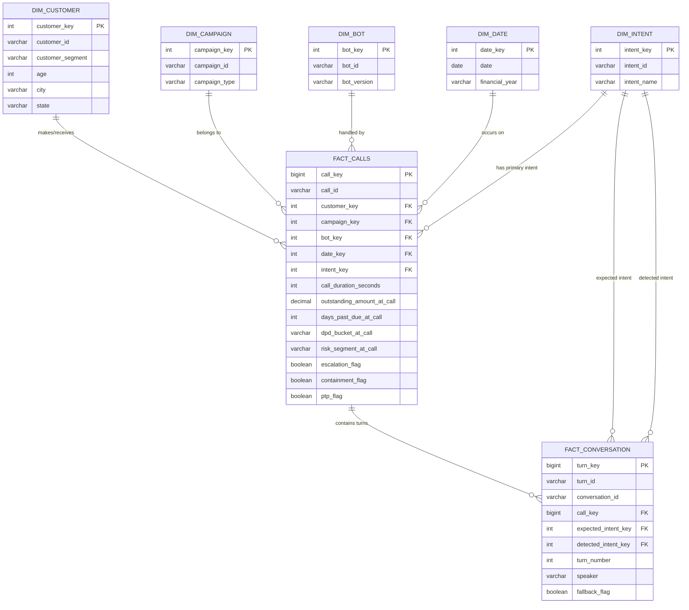

# Entity Relationship (ER) Diagram
**Project:** Insightal AI — Conversational AI & BFSI Voice Analytics Platform

```mermaid
erDiagram
    DIM_CUSTOMER {
        int customer_key PK
        varchar customer_id
        varchar customer_segment
        int age
        varchar city
        varchar state
    }
    
    DIM_CAMPAIGN {
        int campaign_key PK
        varchar campaign_id
        varchar campaign_type
    }

    DIM_BOT {
        int bot_key PK
        varchar bot_id
        varchar bot_version
    }

    DIM_DATE {
        int date_key PK
        date date
        varchar financial_year
    }

    DIM_INTENT {
        int intent_key PK
        varchar intent_id
        varchar intent_name
    }

    FACT_CALLS {
        bigint call_key PK
        varchar call_id
        int customer_key FK
        int campaign_key FK
        int bot_key FK
        int date_key FK
        int intent_key FK
        int call_duration_seconds
        decimal outstanding_amount_at_call
        int days_past_due_at_call
        varchar dpd_bucket_at_call
        varchar risk_segment_at_call
        boolean escalation_flag
        boolean containment_flag
        boolean ptp_flag
    }

    FACT_CONVERSATION {
        bigint turn_key PK
        varchar turn_id
        varchar conversation_id
        bigint call_key FK
        int expected_intent_key FK
        int detected_intent_key FK
        int turn_number
        varchar speaker
        boolean fallback_flag
    }

    DIM_CUSTOMER ||--o{ FACT_CALLS : "makes/receives"
    DIM_CAMPAIGN ||--o{ FACT_CALLS : "belongs to"
    DIM_BOT ||--o{ FACT_CALLS : "handled by"
    DIM_DATE ||--o{ FACT_CALLS : "occurs on"
    DIM_INTENT ||--o{ FACT_CALLS : "has primary intent"

    FACT_CALLS ||--o{ FACT_CONVERSATION : "contains turns"
    DIM_INTENT ||--o{ FACT_CONVERSATION : "expected intent"
    DIM_INTENT ||--o{ FACT_CONVERSATION : "detected intent"
```
